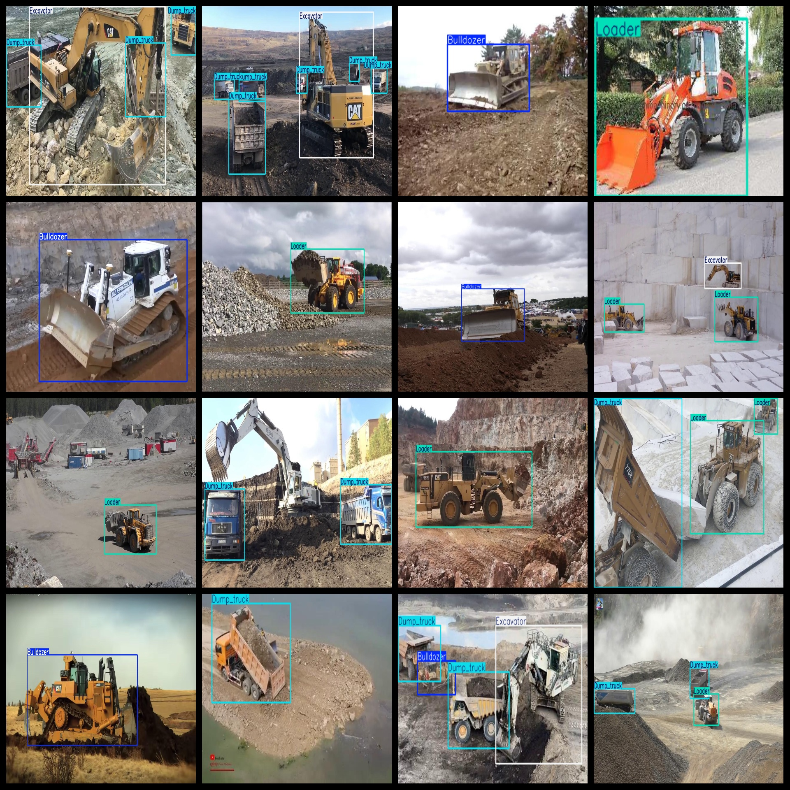
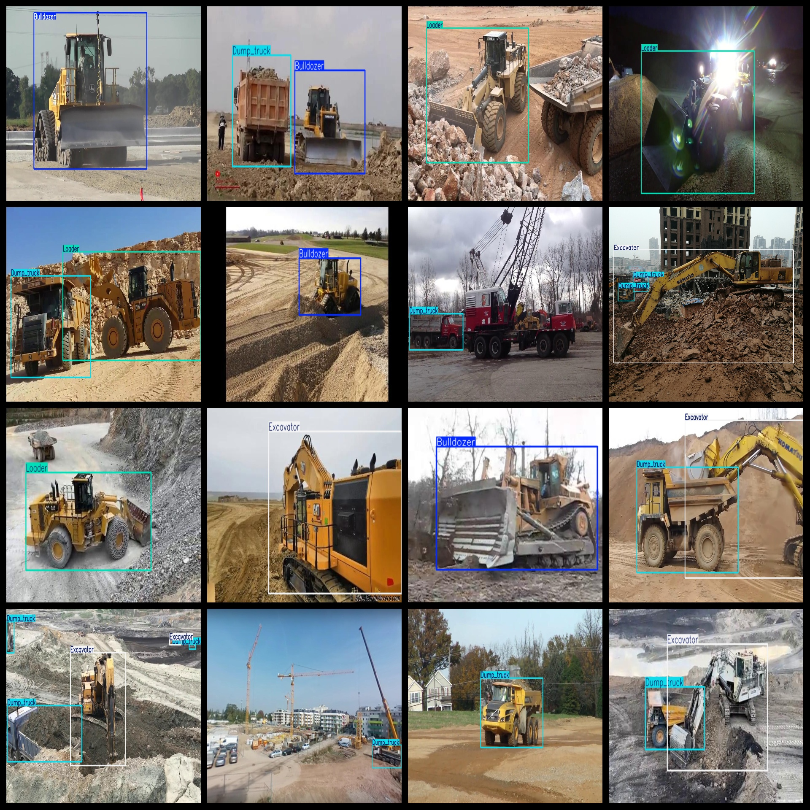

# 4 Types Engineering Vehicle Dataset - 6832 Images in VOC+YOLO Format

The dataset consists of four types of engineering vehicles, labeled in Pascal VOC format and YOLO format. It does not include any split paths in the txt file but only includes jpeg images along with corresponding VOC-formatted xml files and YOLO-formatted txt files.

Number of images (jpg files): 6832
Number of labels (xml files): 6832
Number of labels (txt files): 6832
Number of label categories: 4

GitHub repository for this dataset is: datasets_sl

Label category names according to the order in the yolo format are: ["Bulldozer", "Dump truck", "Excavator", "Loader"]

Chinese translation for the label categories: Bulldozer, Dump truck, Excavator, Loader

Box counts per class:

Bulldozer box count = 1705

Dump truck box count = 4318

Excavator box count = 2918

Loader box count = 2511

Total box count = 11452

Images per class:

Bulldozer images = 1602

Dump truck images = 2602

Excavator images = 2455

Loader images = 2418

Image resolution: 1280x720

Annotation tool used: labelImg

Dataset enhancement status: No

Annotation rules: Draw a rectangle around the category

Important note: The dataset does not have separate training validation test sets; they need to be split manually.

Special declaration: This dataset does not guarantee any accuracy for models trained or weight files created from this dataset.

Details on image and labeling conditions are as follows:

## Images

---

Here is a pay link on Stripe (https://buy.stripe.com/3cs8yP7sY87d0vu9AB). Please contact me lonlonago@foxmail.com after funding $89, and I will send you a complete data files, thank you!

